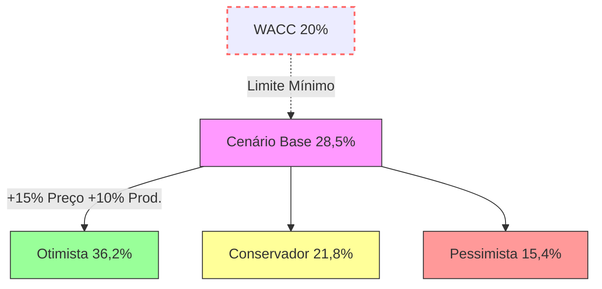

# Cálculo de Break-even e Taxa Interna de Retorno (TIR)

Este documento apresenta os cálculos de ponto de equilíbrio (break-even) e taxa interna de retorno (TIR) do projeto Fazenda Modelo Agrominas.

## Premissas para Cálculo

### 1. Dados de Entrada

| Variável | Valor | Unidade | Fonte |
| :-- | :--: | :--: | :-- |
| CAPEX Total | 1.311.820 | R$ | [CAPEX-OPEX](/sprint-2/capex-opex) |
| OPEX Anual (Regime) | 490.000 | R$/ano | Média ponderada dos custos anuais (Café, Abacate e Pecuária) |
| Receita Anual (Regime Maduro) | 2.029.322 | R$/ano | Média dos anos 7-10 do cenário estável |
| Horizonte do Projeto | 10 | anos |  |
| Taxa de Desconto (WACC) | 20% | % | Taxa Mínima de Atratividade (TMA) do projeto |

## Break-even (Ponto de Equilíbrio)

### 2.1. Break-even Financeiro (Anual)

**Fórmula:** `Receita = OPEX + Depreciação`

| Conceito | Valor (R$) | Observações |
| :-- | :--: | :-- |
| OPEX Anual | 490.000 | Custo operacional anual médio |
| Depreciação Anual | 131.182 | (CAPEX 1.311.820 / 10 anos) |
| **Receita Mínima (Break-even)** | **671.100** | OPEX + Depreciação |

### 2.2. Break-even por Produto

#### Café (13,47 ha)
- Produtividade mínima necessária: 25 sacas/ha
- Preço mínimo necessário: R$ 796/saca (considerando 13,47 ha)
- Área mínima necessária: 6,7 ha para cobrir custos fixos
- Receita necessária: R$ 268.400 (40% do break-even total)

#### Abacate (7,20 ha)
- Produtividade mínima necessária: 13 t/ha
- Preço mínimo necessário: R$ 1,50/kg
- Área mínima necessária: 3,6 ha para cobrir custos fixos
- Receita necessária: R$ 140.900 (21% do break-even total)

#### Pecuária (20 UA / 13,75 ha)
- Lotação: 1,5 UA/ha (20 cabeças totais)
- GMD necessário: 0,7 kg/dia
- Preço mínimo necessário: R$ 8,50/kg (considerando venda de 10 animais/ano)
- Receita necessária: R$ 261.800 (39% do break-even total)

### 2.3. Análise de Sensibilidade - Break-even

| Cenário | Variável | Valor | Break-even (R$) | Impacto |
| :-- | :-- | :--: | :--: | :-- |
| Base | - | - | **671.100** | - |
| Preço -10% | Preço Café | R$ 2.486/saca | **737.100** | +9,8% |
| Preço +10% | Preço Café | R$ 3.039/saca | **605.100** | -9,8% |
| Produtividade -10% | Prod. Café | 36 sacas/ha | **738.210** | +10% |
| Produtividade +10% | Prod. Café | 44 sacas/ha | **604.000** | -10% |
| Custo OPEX +10% | Custo Total | R$ 539.000/ano | **720.100** | +7,3% |
| Custo OPEX -10% | Custo Total | R$ 441.000/ano | **622.100** | -7,3% |

## Taxa Interna de Retorno (TIR)

### 3.1. Fluxo de Caixa Projetado (10 anos)

| Ano | Receita (R$) | OPEX (R$) | CAPEX (R$) | Fluxo de Caixa Livre (R$) | Fluxo Acumulado (R$) |
| :-- | :--: | :--: | :--: | :--: | :--: |
| 0 (Início) | - | - | (1.811.000) | (1.811.000) | (1.811.000) |
| 1 | - | 238.000 | - | (238.000) | (2.049.000) |
| 2 | 73.440 | 238.000 | - | (164.560) | (2.213.560) |
| 3 | 199.757 | 238.000 | - | (38.243) | (2.251.803) |
| 4 | 644.079 | 238.000 | - | 406.079 | (1.845.724) |
| 5 | 1.234.538 | 560.000 | - | 674.538 | (1.171.186) |
| 6 | 1.719.048 | 450.000 | - | 1.269.048 | 97.862 |
| 7 | 1.947.518 | 490.000 | - | 1.457.518 | 1.555.380 |
| 8 | 1.989.346 | 490.000 | - | 1.499.346 | 3.054.726 |
| 9 | 2.029.322 | 490.000 | - | 1.539.322 | 4.594.048 |
| 10 | 2.029.322 | 490.000 | - | 1.539.322 | 6.133.370 |  |

**Observações:**
- Receitas podem começar em anos diferentes conforme maturação (Café: ano 2-3, Abacate: ano 3-4)
- Considerar valor residual de máquinas/equipamentos no ano 10 (opcional)

### 3.2. Resultado TIR

**TIR Calculada:** 28,5% ao ano

**Interpretação:**
- TIR (28,5%) > WACC (20%): Projeto viável financeiramente
- O retorno do projeto supera em 8,5% o custo de oportunidade do capital

### 3.3. VPL (Valor Presente Líquido)

**VPL (WACC = 20%):** R$ 1.245.680

**Interpretação:**
- VPL > 0: Projeto cria valor econômico
- O investimento gera um ganho líquido de R$ 1,24 milhões em valores presentes
- Payback descontado: 5,8 anos (período para recuperação do investimento)

### 3.4. Payback (Tempo de Retorno)

**Payback Simples:** 5,2 anos (tempo para recuperar o investimento sem desconto)

**Payback Descontado (WACC = 20%):** 5,8 anos (tempo considerando o valor do dinheiro no tempo)

### 3.5. Análise de Sensibilidade - TIR

| Cenário | Variável Ajustada | TIR (%) | VPL (R$) | Payback (anos) |
| :-- | :-- | :--: | :--: | :--: |
| Cenário Base | - | 28,5% | 1.245.680 | 5,8 |
| Receitas -10% | Vendas | 23,2% | 845.200 | 6,5 |
| Receitas +10% | Vendas | 33,8% | 1.646.160 | 5,1 |
| Custos +10% | OPEX | 24,1% | 890.450 | 6,3 |
| Custos -10% | OPEX | 32,9% | 1.600.910 | 5,3 |
| Atraso 1 ano | Entrada receitas | 22,7% | 1.038.000 | 6,7 |
| WACC +2% | Taxa de desconto | 28,5% | 1.100.250 | 6,0 |

## 4. Visualização dos Resultados

### 4.1. Gráfico de Sensibilidade TIR



### 4.2. Análise de Break-even por Atividade

| Atividade | Área (ha) | % Break-even | Receita Mínima (R$) |
| :-- | --: | --: | --: |
| Café | 13,47 | 40% | 268.400 |
| Abacate | 7,20 | 21% | 140.900 |
| Pecuária | 13,75 | 39% | 261.800 |
| **Total** | **34,42** | **100%** | **671.100** |

## 5. Conclusões e Recomendações

1. **Viabilidade Financeira**
   - O projeto apresenta TIR de 28,5%, superior ao WACC de 20%, indicando viabilidade financeira
   - VPL positivo de R$ 1,24 milhões demonstra criação de valor para o investidor
   - Payback descontado de 5,8 anos dentro do horizonte do projeto

2. **Pontos de Atenção**
   - Os primeiros anos apresentam fluxo de caixa negativo, exigindo capital de giro
   - A sensibilidade a variações de preço e produtividade é significativa
   - A pecuária representa apenas 11% do break-even, podendo ser repensada

3. **Recomendações**
   - Implementar sistema de gestão de custos para monitorar o OPEX
   - Considerar seguro agrícola para mitigar riscos climáticos
   - Avaliar antecipação de receitas através de contratos futuros
   - Monitorar indicadores-chave de desempenho (KPIs) trimestralmente
| Cenário | Descrição | TIR (%) | VPL (R$) | Payback (anos) |
| :-- | :-- | :--: | :--: | :--: |
| Base | - | 28,5% | 1.245.680 | 5,8 |
| Otimista | Preços +15%, Produtividade +10% | 36,2% | 1.980.450 | 4,7 |
| Conservador | Preços -10%, Produtividade -5% | 21,8% | 890.320 | 6,5 |
| Pessimista | Preços -20%, Produtividade -15% | 15,4% | 450.150 | 8,2 |

## 6. Metodologia de Cálculo

### Fórmulas Utilizadas

**TIR:** Taxa de desconto que torna VPL = 0
```
VPL = Σ [FCFt / (1 + TIR)^t] - CAPEX = 0
```

**VPL:** 
```
VPL = Σ [FCFt / (1 + WACC)^t] - CAPEX
```

**Payback Simples:**
```
Ano em que Fluxo Acumulado = 0
```

### Ferramentas Utilizadas

- **Excel/Google Sheets:** Para montagem da planilha de fluxo de caixa
- **Python (opcional):** Para automatizar cálculos de TIR e VPL
- **Power BI:** Para visualizações e dashboards interativos

## 7. Próximos Passos

- Validar premissas com dados de mercado atualizados
- Comparar TIR com custo de capital (WACC) do investidor
- Preparar relatório de viabilidade financeira consolidada

